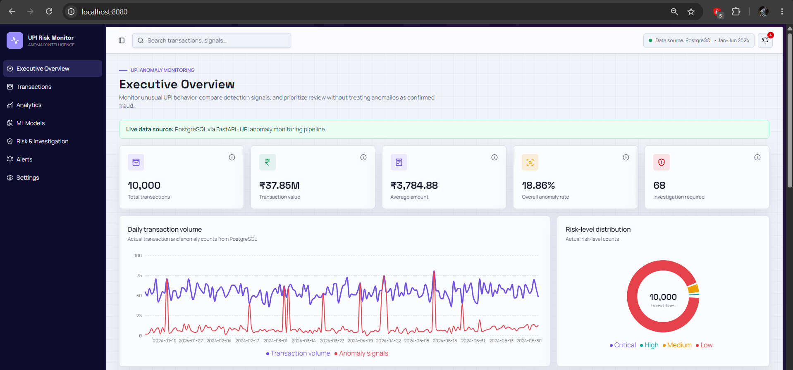
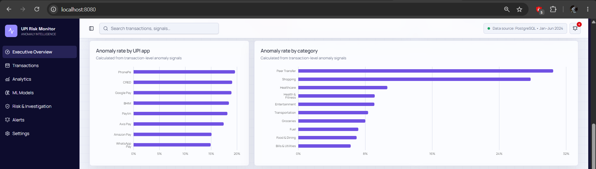
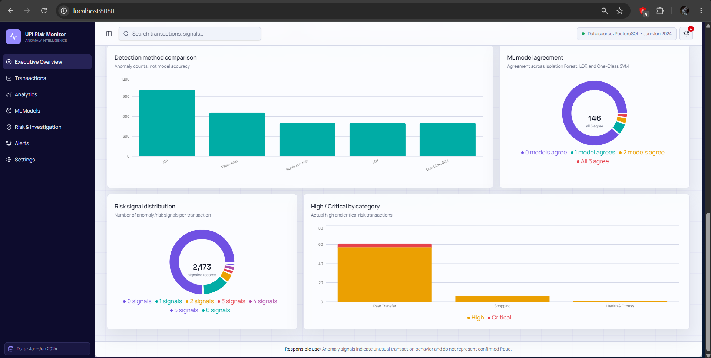
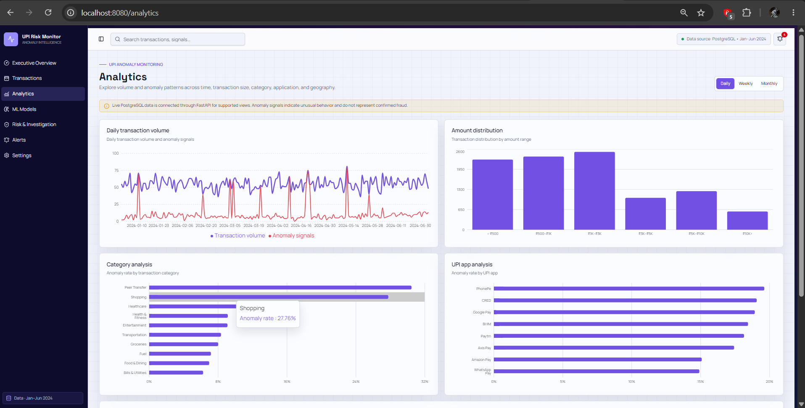
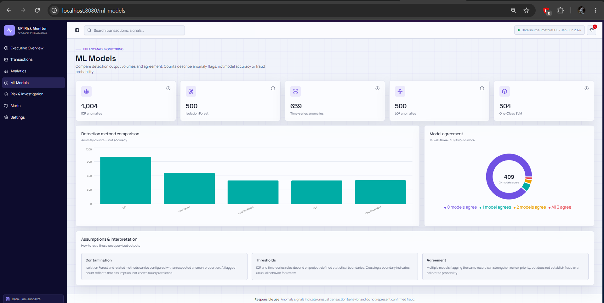
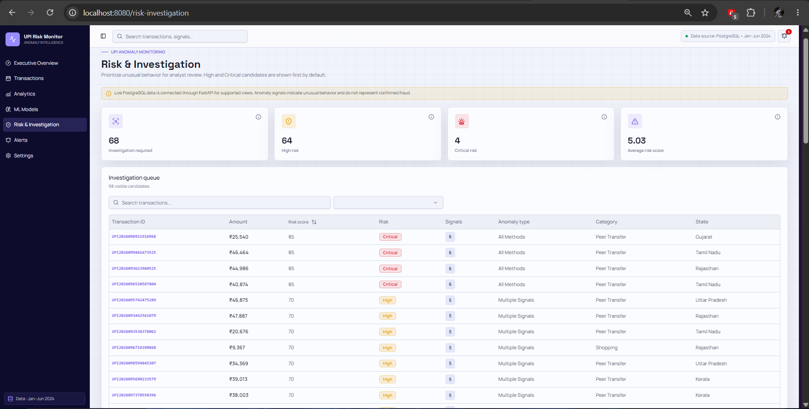
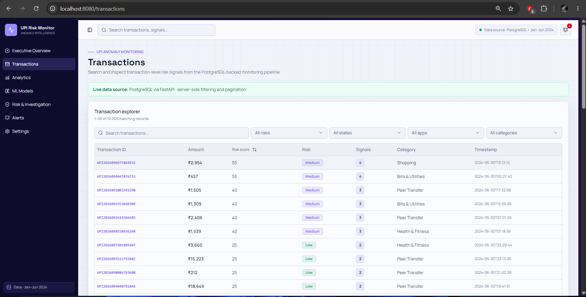
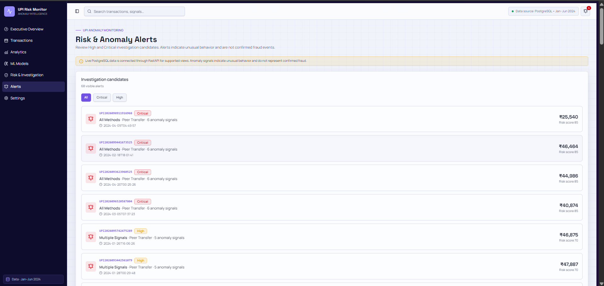
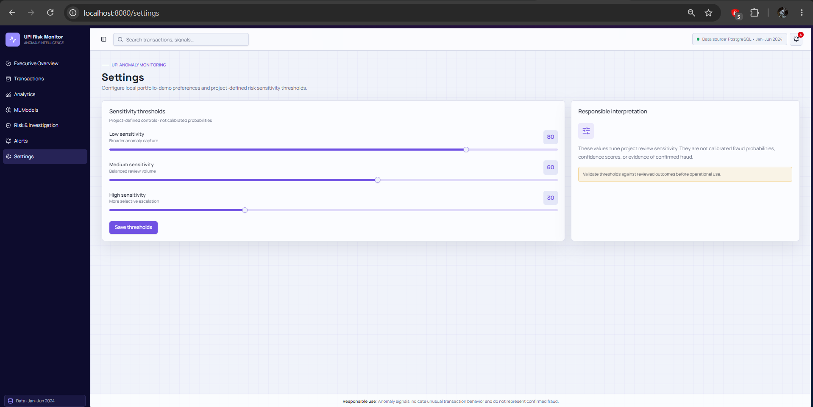

# UPI Transaction Anomaly Detection & Risk Monitoring Platform

A portfolio-ready data engineering and anomaly detection project for analyzing UPI transactions using statistical methods, unsupervised machine learning, PostgreSQL analytics, and an interactive web dashboard.

> **Important:** The dataset does not contain a verified fraud label. This system detects unusual transaction behavior and generates anomaly and risk signals for investigation. An anomaly does not necessarily represent fraud, and the risk score is not a calibrated fraud probability.

---

## Project Overview

The project processes UPI transaction data through an end-to-end analytics pipeline:

**Raw Data → Data Cleaning → EDA → Anomaly Detection → Risk Scoring → PostgreSQL → FastAPI → Interactive Dashboard**

The system combines multiple anomaly detection approaches to identify unusual transaction behavior and provide a consolidated monitoring view.

---

## Key Features

- Data extraction and transformation pipeline
- Data quality checks and duplicate handling
- Exploratory Data Analysis (EDA)
- IQR-based amount anomaly detection
- Isolation Forest anomaly detection
- Local Outlier Factor (LOF)
- One-Class SVM
- Robust time-series anomaly detection
- Multi-signal anomaly combination
- Risk scoring and sensitivity analysis
- Statistical hypothesis testing
- PostgreSQL storage and analytics
- FastAPI REST API
- Interactive React/TanStack dashboard
- Transaction search and filtering
- Risk and investigation queue
- Model agreement analysis
- Anomaly signal distribution
- State, category, UPI app, and amount analysis

---

## Dataset

The project uses a UPI transaction dataset containing **10,000 transactions** covering:

**January 1, 2024 – June 30, 2024**

The dataset includes transaction information such as:

- Transaction ID
- Timestamp
- Sender and receiver information
- Bank information
- Transaction amount
- Transaction type
- Category
- UPI application
- Device OS
- Location state
- Transaction status
- Failure reason

The dataset does not contain a verified fraud ground-truth label.

---

## Anomaly Detection

Multiple techniques are used to detect unusual transaction behavior.

### 1. IQR

The Interquartile Range method identifies unusually large transaction amounts using:

- Q1
- Q3
- IQR
- Upper-bound threshold

### 2. Isolation Forest

An unsupervised Isolation Forest model is used to identify transactions that differ from the majority of observations.

The configured model uses a contamination parameter of 0.05. This is a modeling assumption and should not be interpreted as a 5% fraud rate.

### 3. Local Outlier Factor

LOF identifies observations that have substantially different local density compared with their surrounding observations.

### 4. One-Class SVM

One-Class SVM is used as another unsupervised method for identifying observations that differ from the learned normal pattern.

### 5. Time-Series Anomaly Detection

Daily transaction activity is analyzed to identify unusually high or low activity periods.

A time-series anomaly flag indicates that a transaction occurred during an anomalous period; it does not necessarily mean that the individual transaction itself is anomalous.

---

## Risk Scoring

The project combines multiple anomaly signals into a risk-monitoring score.

Risk levels are grouped into:

- Low
- Medium
- High
- Critical

The risk score is a project-defined monitoring score and is **not a calibrated probability of fraud**.

Transactions meeting the investigation criteria are surfaced in the investigation queue for further review.

---

## Key Results

From the current dataset and configured detection methods:

| Metric | Result |
|---|---:|
| Total transactions | 10,000 |
| IQR anomalies | 1,004 |
| Isolation Forest anomalies | 500 |
| Time-series flagged transactions | 659 |
| LOF anomalies | 500 |
| One-Class SVM anomalies | 504 |
| Investigation-required transactions | 68 |
| High-risk transactions | 64 |
| Critical-risk transactions | 4 |

These are anomaly/risk-monitoring results and should not be interpreted as confirmed fraud cases.

---

## Technology Stack

### Data Engineering & Analysis

- Python
- Pandas
- NumPy
- PostgreSQL
- SQL
- psycopg2
- python-dotenv

### Machine Learning & Statistics

- Scikit-learn
- Isolation Forest
- Local Outlier Factor
- One-Class SVM
- IQR-based statistical detection
- Robust time-series analysis
- Mann–Whitney U test
- Chi-square test

### Backend

- FastAPI
- PostgreSQL
- REST APIs

### Frontend

- React
- TypeScript
- TanStack
- Vite
- Tailwind CSS
- Recharts

### Development

- VS Code
- Git
- GitHub
- PowerShell

---

## Dashboard

The interactive dashboard contains:

### Executive Overview

Provides a high-level view of:

- Transaction volume
- Transaction value
- Average transaction amount
- Anomaly rate
- Investigation-required transactions
- Risk-level distribution
- UPI application analysis
- Category analysis
- Detection method comparison

### Analytics

Provides:

- Daily transaction volume
- Amount distribution
- State transaction volume
- Category anomaly rates
- UPI app anomaly rates

### ML Models

Compares anomaly signals produced by:

- IQR
- Isolation Forest
- Time Series
- LOF
- One-Class SVM

Also includes model agreement analysis and methodology notes.

### Risk & Investigation

Provides:

- Investigation queue
- High-risk transactions
- Critical-risk transactions
- Risk score distribution
- High-risk categories

### Transactions

Provides a transaction explorer with:

- Search
- Risk-level filtering
- State filtering
- UPI app filtering
- Category filtering
- Pagination
- Transaction-level details

---

## Project Structure

```text
UPI project/
│
├── api/
│   ├── main.py
│   └── requirements.txt
│
├── dashboard/
│   ├── src/
│   ├── package.json
│   └── ...
│
├── data/
│   ├── raw/
│   │   └── upi.csv
│   │
│   └── processed/
│       ├── eda_charts/
│       ├── upi_anomaly_results.csv
│       ├── upi_cleaned.csv
│       ├── upi_iqr.csv
│       ├── upi_isolation_forest.csv
│       ├── upi_ml_comparison.csv
│       ├── upi_risk_scores.csv
│       └── upi_time_series.csv
│
├── sql/
│   └── schema.sql
│
├── src/
│   ├── anomaly_detection.py
│   ├── combine_anomalies.py
│   ├── data_quality_check.py
│   ├── eda.py
│   ├── hypothesis_testing.py
│   ├── isolation_forest.py
│   ├── load.py
│   ├── ml_models.py
│   ├── pipeline.py
│   ├── risk_scoring.py
│   ├── sensitivity_analysis.py
│   ├── time_series.py
│   └── transform.py
│
├── generate_upi_data.py
├── requirements.txt
├── start-dev.ps1
├── .gitignore
└── README.md
## 📊 Dashboard Screenshots

### Executive Overview







### Analytics



### ML Models



### Risk & Investigation



### Transactions



### Additional Dashboard Views



